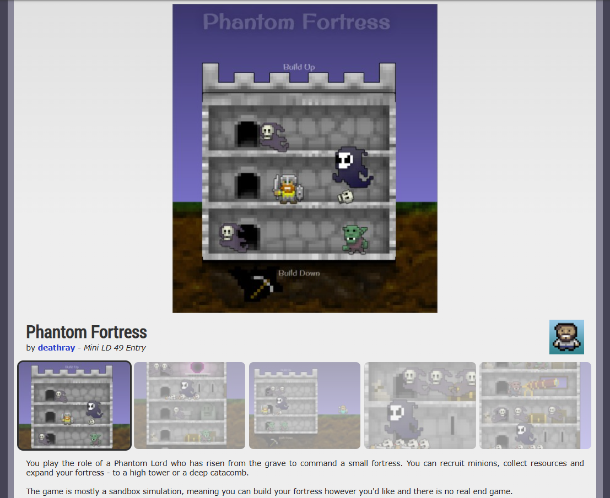

# Phantom Fortress

**Made for Mini-LD 49 (2014)**

This project is no longer maintained here.
It has been moved to: https://github.com/morph-games/phantom-fortress

Original Mini-LD entry page: https://web.archive.org/web/20141212152809/http://ludumdare.com/compo/minild-49/?action=preview&uid=17861

> You play the role of a Phantom Lord who has risen from the grave to command a small fortress. You can recruit minions, collect resources and expand your fortress - to a high tower or a deep catacomb. The game is mostly a sandbox simulation, meaning you can build your fortress however you'd like and there is no real end game.

